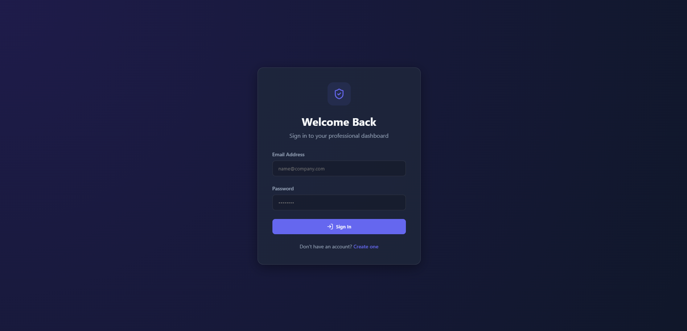
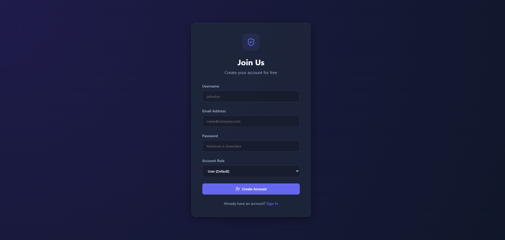

<h1 align="center">🗓️ TaskMaster API</h1>

<p align="center">
  A Scalable REST API with Authentication & Role-Based Access Control
</p>

<p align="center">
  
  
</p>

---

## 🚀 Overview

TaskMaster is a production-ready full-stack application designed to demonstrate secure backend architecture and premium frontend design. It allows users to:

- 🔐 **Register & Authenticate:** Secure JWT-based entry.
- 📋 **Manage Tasks:** Create, read, update, and delete tasks.
- 👮 **RBAC:** Role-based access control (User vs. Admin).
- 🧑‍💻 **Interactive UI:** Premium dashboard with Glassmorphism.
- 📖 **Live Documentation:** Integrated Swagger/OpenAPI support.

---

## 🧠 Tech Stack

### 🖥 Frontend
- React.js (Vite)
- Axios (API Integration)
- Lucide React (Icons)
- Vanilla CSS (Glassmorphism UI)

### ⚙ Backend
- Node.js & Express.js
- Sequelize ORM
- SQLite (Zero-Setup Database)
- JWT Authentication
- Swagger JSDoc

---

## 🏗 System Architecture
**Frontend (React + Context API)**
→ 
**REST API (Node/Express)**
→ 
**SQLite Database (Persistence)**

---

## 🔐 Key Features

✔ **JWT-Based Authentication:** Secure token handling and persistence.  
✔ **Role-Based Authorization:** Custom middleware to protect admin routes.  
✔ **Scalable Project Structure:** Clean separation of controllers, models, and routes.  
✔ **Real-time Feedback:** Responsive UI with success/error alerts.  
✔ **Production Ready:** Optimized builds and detailed scalability planning.  

---

## ⚙️ Local Setup

### 1. Clone Repository
```bash
git clone https://github.com/aryan9855/Assignment1.git
cd Assignment1
```

### 2. Backend Setup
```bash
cd backend
npm install
npm start
```
*Server runs on http://localhost:5000. Docs at /api/docs.*

### 3. Frontend Setup
```bash
cd frontend
npm install
npm run dev
```
*App runs on http://localhost:5173.*

---

## 📈 Scalability & Future Improvements

To scale this system for millions of users, I would implement the following:

1.  **Database Layer:** Transition from SQLite to **PostgreSQL** or **MongoDB Atlas** for high-throughput horizontal scaling.
2.  **Caching:** Integrate **Redis** to cache frequently accessed data to reduce database load.
3.  **Microservices:** Decouple the Auth service from the Task service for independent scaling.
4.  **Load Balancing:** Use **NGINX** or AWS ELB to distribute traffic across containerized instances.
5.  **Monitoring:** Implement **Winston/Morgan** for logging and **Prometheus** for performance tracking.

---

## 👨‍💻 Developer
**Aryan Singhal**  
Full-Stack Developer  
Passionate about building scalable web applications 🚀

---

## 📸 Screenshots

### 🏠 Dashboard
<p align="center">
  
</p>

### 🔐 Auth Screens
<p align="center">
  
  
</p>
